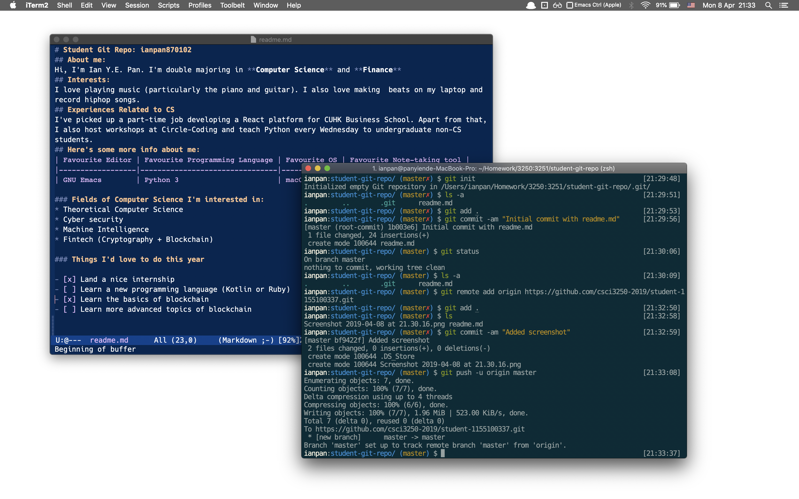

# Student Git Repo: ianpan870102
## About me:
Hi, I'm Ian Y.E. Pan. I'm double majoring in **Computer Science** and **Finance**
## Interests:
I love playing music (particularly the piano and guitar). I also love making  beats on my laptop and record hiphop songs.
## Experiences Related to CS
I've picked up a part-time job developing a React platform for CUHK Business School. Apart from that, I also host workshops at Circle-Coding and teach Python every Wednesday to undergraduate non-CS students.
## Here's some more info about me:
| Favourite Editor | Favourite Programming Language | Favourite OS | Favourite Note-taking tool |
|------------------|--------------------------------|--------------|----------------------------|
| GNU Emacs        | Python 3                       | macOS        | Org Mode + LaTeX           |

### Fields of Computer Science I'm interested in:
* Theoretical Computer Science
* Cyber security
* Machine Intelligence
* Fintech (Cryptography + Blockchain)

### Things I'd love to do this year

- [x] Land a nice internship
- [ ] Learn a new programming language (Kotlin or Ruby)
- [x] Learn the basics of blockchain
- [ ] Learn more advanced topics of blockchain

## Finally, this is the screenshot I included with all the commands I typed in the terminal

